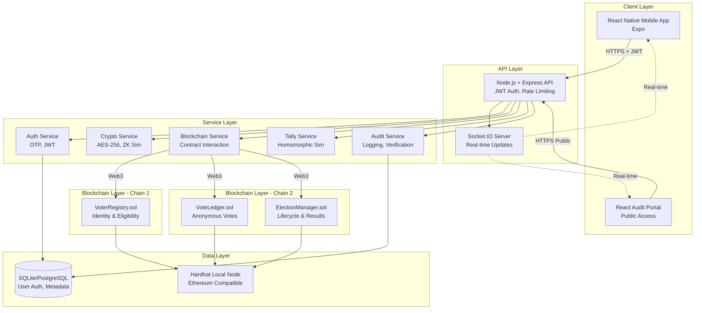
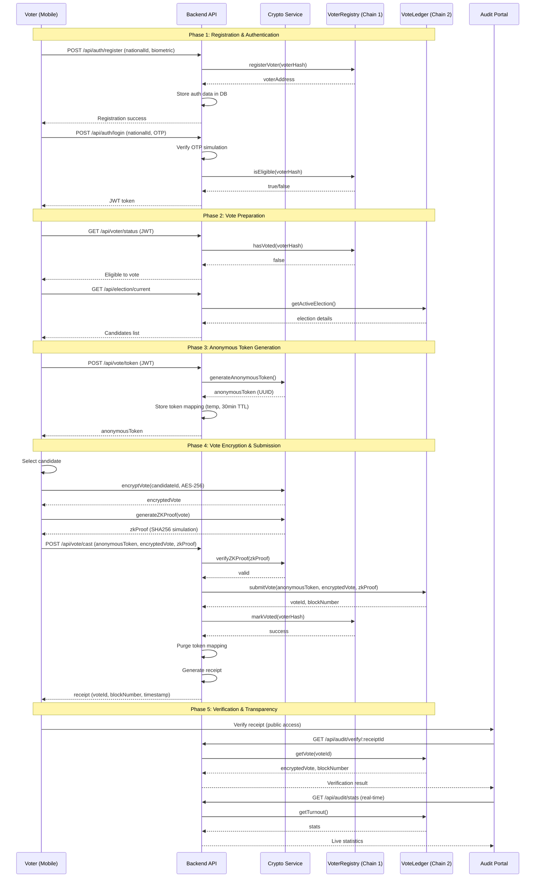

# Design Document: SecureVote - Blockchain-Based Electronic Voting System MVP

## Overview

SecureVote is a production-ready MVP demonstrating a blockchain-based electronic voting system designed for national-scale hackathon demonstration. The system implements a two-chain architecture separating voter identity (VoterRegistry on Chain 1) from vote records (VoteLedger on Chain 2) to ensure voter anonymity while maintaining election integrity. The platform combines React Native mobile app, Node.js backend, Ethereum-compatible smart contracts, and a public audit portal to deliver end-to-end encrypted voting with zero-knowledge proof simulation, homomorphic tally simulation, and real-time transparency.

The architecture enforces one-person-one-vote through blockchain-backed voter registration, issues anonymous single-use voting tokens to decouple identity from votes, encrypts votes client-side with AES-256, simulates zero-knowledge proofs for vote validity, and provides both individual verifiability (via receipts) and universal verifiability (via public audit portal). The system includes coercion resistance through a 30-minute re-voting window, device security checks, post-vote data purge, and comprehensive audit logging without storing PII.

## Architecture

The system follows a layered architecture with clear separation of concerns across mobile client, backend API, blockchain layer, and audit portal.



### Two-Chain Architecture Rationale

The system uses two separate smart contracts (chains) to achieve voter anonymity:
- **Chain 1 (VoterRegistry)**: Maps voter identity to eligibility and has_voted status. Never stores vote content.
- **Chain 2 (VoteLedger)**: Stores encrypted votes with anonymous tokens. Never stores voter identity.

This separation ensures that even with full blockchain access, votes cannot be linked to voters.

## Main Algorithm/Workflow

### Complete Voting Flow



## Components and Interfaces

### Component 1: Mobile App (React Native + Expo)

**Purpose**: Provides voter-facing interface for registration, authentication, voting, and receipt verification with security checks and polished UX.

**Key Screens**:
- Auth Flow: register.tsx, login.tsx
- Voter Flow: dashboard.tsx, vote.tsx (5-step), receipt.tsx, verify.tsx
- Admin Flow: admin-dashboard.tsx, election-setup.tsx, results.tsx

**Interface**:
```typescript
// Core navigation types
interface RootStackParamList {
  Register: undefined;
  Login: undefined;
  Dashboard: undefined;
  Vote: { electionId: string };
  Receipt: { voteData: VoteReceipt };
  Verify: undefined;
  AdminDashboard: undefined;
}

// Vote submission flow
interface VoteSubmissionService {
  prepareVote(candidateId: string): Promise<PreparedVote>;
  encryptVote(vote: Vote, publicKey: string): Promise<EncryptedVote>;
  generateZKProof(vote: Vote): Promise<ZKProof>;
  submitVote(submission: VoteSubmission): Promise<VoteReceipt>;
}

// Security checks
interface DeviceSecurityService {
  checkRootStatus(): Promise<boolean>;
  checkJailbreakStatus(): Promise<boolean>;
  validateDeviceIntegrity(): Promise<SecurityReport>;
}
```

**Responsibilities**:
- Client-side vote encryption (AES-256)
- ZK proof generation (SHA256-based simulation)
- Device security validation
- Biometric authentication integration
- Receipt QR code generation
- Real-time stats display via Socket.IO
- Haptic feedback and animations


### Component 2: Backend API (Node.js + Express)

**Purpose**: Orchestrates authentication, blockchain interaction, cryptographic operations, and audit logging while enforcing security policies.

**Interface**:
```typescript
// Authentication endpoints
interface AuthController {
  register(req: RegisterRequest): Promise<RegisterResponse>;
  login(req: LoginRequest): Promise<LoginResponse>;
  verifyOTP(req: OTPRequest): Promise<TokenResponse>;
}

// Voting endpoints
interface VoteController {
  getVoterStatus(req: AuthenticatedRequest): Promise<VoterStatus>;
  getCurrentElection(req: Request): Promise<Election>;
  generateVotingToken(req: AuthenticatedRequest): Promise<VotingToken>;
  castVote(req: CastVoteRequest): Promise<VoteReceipt>;
}

// Audit endpoints (public)
interface AuditController {
  verifyReceipt(receiptId: string): Promise<VerificationResult>;
  getPublicStats(): Promise<ElectionStats>;
  getBlockchainProof(voteId: string): Promise<BlockchainProof>;
}

// Admin endpoints
interface AdminController {
  setupElection(req: ElectionSetupRequest): Promise<Election>;
  finalizeElection(electionId: string): Promise<FinalResults>;
  getResults(electionId: string): Promise<Results>;
}
```

**Responsibilities**:
- JWT authentication and session management
- Rate limiting (100 req/15min global, 5 req/min vote casting)
- Request validation and sanitization
- Blockchain transaction orchestration
- Audit event logging
- Real-time updates via Socket.IO
- Security headers (Helmet)

### Component 3: Crypto Service

**Purpose**: Handles all cryptographic operations including encryption, ZK proof simulation, and homomorphic tally simulation.

**Interface**:
```typescript
interface CryptoService {
  // Vote encryption
  encryptVote(vote: Vote, publicKey: string): Promise<EncryptedVote>;
  decryptVote(encryptedVote: EncryptedVote, privateKey: string): Promise<Vote>;
  
  // ZK proof simulation (SHA256-based)
  generateZKProof(vote: Vote, randomness: string): Promise<ZKProof>;
  verifyZKProof(proof: ZKProof, publicInputs: PublicInputs): Promise<boolean>;
  
  // Homomorphic tally simulation
  initializeHomomorphicTally(electionId: string): Promise<TallyState>;
  addEncryptedVote(tally: TallyState, encryptedVote: EncryptedVote): Promise<TallyState>;
  finalizeHomomorphicTally(tally: TallyState, privateKey: string): Promise<Results>;
  
  // Token generation
  generateAnonymousToken(): string;
  hashVoterIdentity(nationalId: string): string;
}
```

**Responsibilities**:
- AES-256-GCM vote encryption/decryption
- SHA256-based ZK proof simulation with clear labeling
- Homomorphic tally simulation (additive homomorphism simulation)
- Secure random number generation
- Key management (election keys)
- PII hashing (SHA256 with salt)


### Component 4: Blockchain Service

**Purpose**: Manages Web3 interactions with smart contracts on both chains, handling voter registration, vote submission, and election lifecycle.

**Interface**:
```typescript
interface BlockchainService {
  // Chain 1: VoterRegistry operations
  registerVoter(voterHash: string, constituencyId: string): Promise<TransactionReceipt>;
  isEligible(voterHash: string): Promise<boolean>;
  hasVoted(voterHash: string): Promise<boolean>;
  markVoted(voterHash: string): Promise<TransactionReceipt>;
  
  // Chain 2: VoteLedger operations
  submitVote(
    anonymousToken: string,
    encryptedVote: string,
    zkProof: string,
    constituencyId: string
  ): Promise<VoteSubmissionResult>;
  getVote(voteId: string): Promise<EncryptedVoteRecord>;
  getConstituencyTally(constituencyId: string): Promise<number>;
  
  // ElectionManager operations
  createElection(config: ElectionConfig): Promise<string>;
  startElection(electionId: string): Promise<TransactionReceipt>;
  endElection(electionId: string): Promise<TransactionReceipt>;
  finalizeResults(electionId: string, results: Results): Promise<TransactionReceipt>;
  getElectionStatus(electionId: string): Promise<ElectionStatus>;
}
```

**Responsibilities**:
- Web3 provider initialization (Hardhat local node)
- Contract ABI loading and instantiation
- Transaction signing and submission
- Event listening and parsing
- Gas estimation and optimization
- Error handling and retry logic

### Component 5: Smart Contracts (Solidity)

**Purpose**: Immutable blockchain logic for voter registration, vote storage, and election management with on-chain verification.

**VoterRegistry.sol (Chain 1)**:
```solidity
interface IVoterRegistry {
    // Voter registration
    function registerVoter(
        bytes32 voterHash,
        string memory constituencyId
    ) external returns (address voterAddress);
    
    // Eligibility checks
    function isEligible(bytes32 voterHash) external view returns (bool);
    function hasVoted(bytes32 voterHash) external view returns (bool);
    
    // Vote marking
    function markVoted(bytes32 voterHash) external;
    
    // Admin functions
    function addConstituency(string memory constituencyId) external;
    function getTotalRegistered() external view returns (uint256);
    
    // Events
    event VoterRegistered(bytes32 indexed voterHash, string constituencyId, uint256 timestamp);
    event VoterMarkedVoted(bytes32 indexed voterHash, uint256 timestamp);
}
```

**VoteLedger.sol (Chain 2)**:
```solidity
interface IVoteLedger {
    // Vote submission
    function submitVote(
        bytes32 anonymousToken,
        string memory encryptedVote,
        string memory zkProof,
        string memory constituencyId
    ) external returns (bytes32 voteId);
    
    // Vote retrieval (for verification)
    function getVote(bytes32 voteId) external view returns (
        string memory encryptedVote,
        uint256 blockNumber,
        uint256 timestamp
    );
    
    // Tally functions
    function getConstituencyVoteCount(string memory constituencyId) external view returns (uint256);
    function getTotalVotes() external view returns (uint256);
    
    // Events
    event VoteSubmitted(
        bytes32 indexed voteId,
        bytes32 indexed anonymousToken,
        string constituencyId,
        uint256 blockNumber,
        uint256 timestamp
    );
}
```


**ElectionManager.sol**:
```solidity
interface IElectionManager {
    // Election lifecycle
    function createElection(
        string memory name,
        uint256 startTime,
        uint256 endTime,
        string[] memory candidateIds
    ) external returns (bytes32 electionId);
    
    function startElection(bytes32 electionId) external;
    function endElection(bytes32 electionId) external;
    
    // Results finalization
    function finalizeResults(
        bytes32 electionId,
        string[] memory candidateIds,
        uint256[] memory voteCounts
    ) external;
    
    // Query functions
    function getElectionStatus(bytes32 electionId) external view returns (
        string memory name,
        uint256 startTime,
        uint256 endTime,
        bool isActive,
        bool isFinalized
    );
    
    function getResults(bytes32 electionId) external view returns (
        string[] memory candidateIds,
        uint256[] memory voteCounts
    );
    
    // Events
    event ElectionCreated(bytes32 indexed electionId, string name, uint256 startTime);
    event ElectionStarted(bytes32 indexed electionId, uint256 timestamp);
    event ElectionEnded(bytes32 indexed electionId, uint256 timestamp);
    event ResultsFinalized(bytes32 indexed electionId, uint256 timestamp);
}
```

**Responsibilities**:
- Immutable voter registration records
- Anonymous vote storage with encryption
- One-person-one-vote enforcement
- Election lifecycle state management
- Event emission for transparency
- Gas-optimized storage patterns

### Component 6: Audit Portal (React Web App)

**Purpose**: Public-facing transparency interface for vote verification, real-time statistics, and blockchain proof inspection.

**Interface**:
```typescript
interface AuditPortalService {
  // Public verification
  verifyReceipt(receiptId: string): Promise<VerificationResult>;
  getBlockchainProof(voteId: string): Promise<BlockchainProof>;
  
  // Real-time statistics
  subscribeToStats(): Observable<ElectionStats>;
  getTurnoutByConstituency(): Promise<ConstituencyStats[]>;
  
  // Blockchain explorer
  getRecentVotes(limit: number): Promise<VoteRecord[]>;
  getBlockDetails(blockNumber: number): Promise<BlockDetails>;
}
```

**Responsibilities**:
- Receipt verification UI
- Real-time statistics dashboard
- Blockchain proof display
- QR code scanning for receipts
- Constituency-level turnout visualization
- No authentication required (public access)

## Data Models

### Model 1: Voter

```typescript
interface Voter {
  id: string;                    // UUID (internal DB only)
  voterHash: string;             // SHA256(nationalId + salt) - stored on-chain
  constituencyId: string;        // Geographic constituency
  registeredAt: Date;
  hasVoted: boolean;             // Synced from blockchain
  voterAddress?: string;         // Ethereum address (optional)
}
```

**Validation Rules**:
- voterHash must be unique
- constituencyId must exist in constituencies table
- hasVoted is read-only (updated from blockchain)
- No PII stored (nationalId never persisted)

### Model 2: AuthCredentials

```typescript
interface AuthCredentials {
  id: string;                    // UUID
  voterHash: string;             // FK to Voter
  passwordHash: string;          // bcrypt hash
  otpSecret?: string;            // TOTP secret (simulation)
  lastLogin?: Date;
  failedAttempts: number;
  lockedUntil?: Date;
}
```

**Validation Rules**:
- passwordHash must use bcrypt with cost factor 12
- failedAttempts max 5 before lock
- lockedUntil auto-expires after 30 minutes
- otpSecret encrypted at rest


### Model 3: VotingToken

```typescript
interface VotingToken {
  token: string;                 // UUID v4 (anonymous)
  voterHash: string;             // Temporary mapping (purged after vote)
  electionId: string;
  constituencyId: string;
  issuedAt: Date;
  expiresAt: Date;               // 30 minutes TTL
  used: boolean;
}
```

**Validation Rules**:
- token must be cryptographically random UUID v4
- expiresAt = issuedAt + 30 minutes
- Purged immediately after vote submission
- One active token per voter per election
- used flag prevents double-spending

### Model 4: VoteReceipt

```typescript
interface VoteReceipt {
  receiptId: string;             // UUID (public identifier)
  voteId: string;                // Blockchain vote ID (bytes32)
  blockNumber: number;           // Block where vote was recorded
  transactionHash: string;       // Ethereum transaction hash
  timestamp: Date;
  constituencyId: string;
  zkProofHash: string;           // SHA256 of ZK proof
  verificationUrl: string;       // Public audit portal URL
}
```

**Validation Rules**:
- receiptId is publicly shareable (no PII)
- voteId maps to on-chain vote record
- blockNumber must be valid and confirmed
- timestamp matches blockchain timestamp
- verificationUrl points to audit portal

### Model 5: Election

```typescript
interface Election {
  id: string;                    // UUID
  blockchainId: string;          // bytes32 from ElectionManager
  name: string;
  description: string;
  startTime: Date;
  endTime: Date;
  status: 'draft' | 'active' | 'ended' | 'finalized';
  candidates: Candidate[];
  constituencies: string[];
  allowRevoting: boolean;        // 30-minute window
  revotingWindowMinutes: number; // Default 30
  createdBy: string;             // Admin user ID
}

interface Candidate {
  id: string;                    // UUID
  name: string;
  party: string;
  constituencyId: string;
  photoUrl?: string;
  manifesto?: string;
}
```

**Validation Rules**:
- startTime must be in future (for draft elections)
- endTime must be after startTime
- Minimum election duration: 1 hour
- Maximum election duration: 7 days
- candidates array must have at least 2 candidates
- Each constituency must have at least 2 candidates

### Model 6: AuditLog

```typescript
interface AuditLog {
  id: string;                    // UUID
  eventType: AuditEventType;
  actorHash?: string;            // Hashed actor identity (optional)
  resourceId?: string;           // Related resource (electionId, voteId, etc.)
  action: string;
  metadata: Record<string, any>; // Additional context (no PII)
  ipAddress?: string;            // Hashed IP
  userAgent?: string;
  timestamp: Date;
  severity: 'info' | 'warning' | 'critical';
}

enum AuditEventType {
  VOTER_REGISTERED = 'voter_registered',
  VOTER_LOGIN = 'voter_login',
  TOKEN_ISSUED = 'token_issued',
  VOTE_CAST = 'vote_cast',
  VOTE_VERIFIED = 'vote_verified',
  ELECTION_CREATED = 'election_created',
  ELECTION_STARTED = 'election_started',
  ELECTION_ENDED = 'election_ended',
  RESULTS_FINALIZED = 'results_finalized',
  SECURITY_VIOLATION = 'security_violation',
  RATE_LIMIT_EXCEEDED = 'rate_limit_exceeded'
}
```

**Validation Rules**:
- All critical events must be logged
- No PII in metadata (use hashes)
- ipAddress stored as SHA256 hash
- Logs are append-only (no updates/deletes)
- Retention period: 7 years (compliance)


## Algorithmic Pseudocode

### Main Processing Algorithm: Complete Vote Submission Flow

```typescript
async function processVoteSubmission(
  voterJWT: string,
  candidateId: string,
  electionId: string
): Promise<VoteReceipt>
```

**Preconditions:**
- voterJWT is valid and not expired
- candidateId exists in the election
- electionId corresponds to an active election
- Voter has not voted yet (or within re-voting window)
- Device security checks passed

**Postconditions:**
- Vote is encrypted and stored on blockchain
- Voter is marked as voted on Chain 1
- Anonymous token is purged from database
- Receipt is generated and returned
- Audit log entry created
- No link between voter identity and vote content exists

**Algorithm:**

```typescript
ALGORITHM processVoteSubmission(voterJWT, candidateId, electionId)
INPUT: 
  voterJWT: JWT token containing voterHash
  candidateId: string (UUID of selected candidate)
  electionId: string (UUID of election)
OUTPUT: 
  receipt: VoteReceipt object

BEGIN
  // Step 1: Authenticate and validate voter
  ASSERT isValidJWT(voterJWT) = true
  voterHash ← extractVoterHash(voterJWT)
  
  // Step 2: Check eligibility on blockchain (Chain 1)
  isEligible ← blockchainService.isEligible(voterHash)
  ASSERT isEligible = true
  
  hasVoted ← blockchainService.hasVoted(voterHash)
  IF hasVoted = true THEN
    lastVoteTime ← getLastVoteTime(voterHash)
    currentTime ← getCurrentTime()
    
    IF (currentTime - lastVoteTime) > REVOTING_WINDOW THEN
      THROW Error("Already voted, re-voting window expired")
    END IF
    // Allow re-voting within window
  END IF
  
  // Step 3: Validate election and candidate
  election ← getElection(electionId)
  ASSERT election.status = 'active'
  ASSERT candidateId IN election.candidates
  ASSERT getCurrentTime() BETWEEN election.startTime AND election.endTime
  
  // Step 4: Generate or retrieve anonymous token
  existingToken ← getActiveToken(voterHash, electionId)
  
  IF existingToken EXISTS AND NOT existingToken.used THEN
    anonymousToken ← existingToken.token
  ELSE
    anonymousToken ← cryptoService.generateAnonymousToken()
    storeToken(anonymousToken, voterHash, electionId, 30 minutes TTL)
  END IF
  
  // Step 5: Prepare vote data
  vote ← {
    candidateId: candidateId,
    electionId: electionId,
    timestamp: getCurrentTime(),
    constituencyId: getConstituency(voterHash)
  }
  
  // Step 6: Encrypt vote (client-side in real implementation)
  electionPublicKey ← getElectionPublicKey(electionId)
  encryptedVote ← cryptoService.encryptVote(vote, electionPublicKey)
  
  // Step 7: Generate ZK proof (simulation)
  randomness ← generateSecureRandom(32 bytes)
  zkProof ← cryptoService.generateZKProof(vote, randomness)
  
  // Step 8: Verify ZK proof
  publicInputs ← {
    electionId: electionId,
    constituencyId: vote.constituencyId,
    timestamp: vote.timestamp
  }
  isValidProof ← cryptoService.verifyZKProof(zkProof, publicInputs)
  ASSERT isValidProof = true
  
  // Step 9: Submit to blockchain (Chain 2)
  voteSubmissionResult ← blockchainService.submitVote(
    anonymousToken,
    encryptedVote,
    zkProof,
    vote.constituencyId
  )
  
  ASSERT voteSubmissionResult.success = true
  voteId ← voteSubmissionResult.voteId
  blockNumber ← voteSubmissionResult.blockNumber
  transactionHash ← voteSubmissionResult.transactionHash
  
  // Step 10: Mark voter as voted (Chain 1)
  markVotedResult ← blockchainService.markVoted(voterHash)
  ASSERT markVotedResult.success = true
  
  // Step 11: Purge anonymous token mapping
  deleteToken(anonymousToken)
  
  // Step 12: Generate receipt
  receipt ← {
    receiptId: generateUUID(),
    voteId: voteId,
    blockNumber: blockNumber,
    transactionHash: transactionHash,
    timestamp: getCurrentTime(),
    constituencyId: vote.constituencyId,
    zkProofHash: SHA256(zkProof),
    verificationUrl: generateVerificationUrl(voteId)
  }
  
  // Step 13: Log audit event
  logAuditEvent({
    eventType: VOTE_CAST,
    actorHash: voterHash,
    resourceId: voteId,
    metadata: {
      electionId: electionId,
      blockNumber: blockNumber,
      constituencyId: vote.constituencyId
    },
    severity: 'info'
  })
  
  // Step 14: Emit real-time update
  socketService.emit('vote_cast', {
    electionId: electionId,
    constituencyId: vote.constituencyId,
    totalVotes: getTotalVotes(electionId)
  })
  
  RETURN receipt
END
```

**Loop Invariants:** N/A (no loops in main flow)

**Error Handling:**
- JWT validation failure → 401 Unauthorized
- Eligibility check failure → 403 Forbidden
- Already voted (outside window) → 409 Conflict
- Election not active → 400 Bad Request
- Blockchain transaction failure → 503 Service Unavailable
- All errors logged to audit log with severity


### Algorithm: Vote Encryption (AES-256-GCM)

```typescript
async function encryptVote(vote: Vote, publicKey: string): Promise<EncryptedVote>
```

**Preconditions:**
- vote object is well-formed with required fields
- publicKey is valid AES-256 key (32 bytes)

**Postconditions:**
- Returns encrypted vote with IV and auth tag
- Original vote data is not modified
- Encryption is authenticated (GCM mode)

**Algorithm:**

```typescript
ALGORITHM encryptVote(vote, publicKey)
INPUT:
  vote: Vote object {candidateId, electionId, timestamp, constituencyId}
  publicKey: string (hex-encoded 32-byte key)
OUTPUT:
  encryptedVote: EncryptedVote {ciphertext, iv, authTag}

BEGIN
  // Step 1: Serialize vote to JSON
  voteJSON ← JSON.stringify(vote)
  
  // Step 2: Generate random IV (12 bytes for GCM)
  iv ← generateSecureRandom(12 bytes)
  
  // Step 3: Convert key from hex to buffer
  keyBuffer ← hexToBuffer(publicKey)
  ASSERT keyBuffer.length = 32 bytes
  
  // Step 4: Create cipher
  cipher ← createCipherGCM('aes-256-gcm', keyBuffer, iv)
  
  // Step 5: Encrypt
  ciphertext ← cipher.update(voteJSON, 'utf8', 'hex')
  ciphertext ← ciphertext + cipher.final('hex')
  
  // Step 6: Get authentication tag
  authTag ← cipher.getAuthTag()
  
  // Step 7: Return encrypted package
  encryptedVote ← {
    ciphertext: ciphertext,
    iv: bufferToHex(iv),
    authTag: bufferToHex(authTag),
    algorithm: 'aes-256-gcm'
  }
  
  RETURN encryptedVote
END
```

**Loop Invariants:** N/A

### Algorithm: ZK Proof Generation (SHA256-based Simulation)

```typescript
async function generateZKProof(vote: Vote, randomness: string): Promise<ZKProof>
```

**Preconditions:**
- vote object contains valid candidateId and electionId
- randomness is 32-byte cryptographically secure random value

**Postconditions:**
- Returns ZK proof structure with commitment and challenge-response
- Proof is deterministic given same inputs
- Labeled as simulation for hackathon demo

**Algorithm:**

```typescript
ALGORITHM generateZKProof(vote, randomness)
INPUT:
  vote: Vote object
  randomness: string (hex-encoded 32 bytes)
OUTPUT:
  zkProof: ZKProof object

BEGIN
  // Step 1: Create commitment (hash of vote + randomness)
  voteString ← vote.candidateId + vote.electionId + vote.timestamp
  commitment ← SHA256(voteString + randomness)
  
  // Step 2: Generate challenge (hash of commitment)
  challenge ← SHA256(commitment + 'challenge_salt')
  
  // Step 3: Generate response (hash of randomness + challenge)
  response ← SHA256(randomness + challenge)
  
  // Step 4: Create proof structure
  zkProof ← {
    commitment: commitment,
    challenge: challenge,
    response: response,
    proofType: 'sha256-simulation',
    version: '1.0',
    metadata: {
      note: 'Simulation for hackathon demo',
      productionNote: 'Replace with zk-SNARKs (e.g., circom + snarkjs) for production'
    }
  }
  
  RETURN zkProof
END
```

**Loop Invariants:** N/A


### Algorithm: ZK Proof Verification

```typescript
async function verifyZKProof(proof: ZKProof, publicInputs: PublicInputs): Promise<boolean>
```

**Preconditions:**
- proof contains commitment, challenge, and response
- publicInputs contains electionId and constituencyId

**Postconditions:**
- Returns true if proof is valid, false otherwise
- No side effects on inputs

**Algorithm:**

```typescript
ALGORITHM verifyZKProof(proof, publicInputs)
INPUT:
  proof: ZKProof {commitment, challenge, response, proofType}
  publicInputs: PublicInputs {electionId, constituencyId, timestamp}
OUTPUT:
  isValid: boolean

BEGIN
  // Step 1: Verify proof type
  IF proof.proofType ≠ 'sha256-simulation' THEN
    RETURN false
  END IF
  
  // Step 2: Recompute challenge from commitment
  expectedChallenge ← SHA256(proof.commitment + 'challenge_salt')
  
  IF proof.challenge ≠ expectedChallenge THEN
    RETURN false
  END IF
  
  // Step 3: Verify response structure (basic validation)
  IF length(proof.response) ≠ 64 THEN  // SHA256 hex length
    RETURN false
  END IF
  
  // Step 4: Verify timestamp is within election window
  election ← getElection(publicInputs.electionId)
  IF publicInputs.timestamp < election.startTime OR 
     publicInputs.timestamp > election.endTime THEN
    RETURN false
  END IF
  
  // Step 5: All checks passed
  RETURN true
END
```

**Loop Invariants:** N/A

### Algorithm: Homomorphic Tally (Simulation)

```typescript
async function computeHomomorphicTally(
  electionId: string,
  privateKey: string
): Promise<Results>
```

**Preconditions:**
- electionId corresponds to an ended election
- privateKey is the election's decryption key
- All votes have been submitted and are on blockchain

**Postconditions:**
- Returns final tally without decrypting individual votes (simulation)
- Each candidate has accurate vote count
- Total votes equals sum of all candidate votes

**Algorithm:**

```typescript
ALGORITHM computeHomomorphicTally(electionId, privateKey)
INPUT:
  electionId: string
  privateKey: string (hex-encoded 32-byte key)
OUTPUT:
  results: Results {candidateId → voteCount}

BEGIN
  // Step 1: Initialize tally state
  election ← getElection(electionId)
  tallyState ← initializeTallyState(election.candidates)
  
  // Step 2: Retrieve all encrypted votes from blockchain
  encryptedVotes ← blockchainService.getAllVotes(electionId)
  
  // Step 3: Process votes homomorphically (simulation)
  FOR each encryptedVote IN encryptedVotes DO
    // In real homomorphic encryption, this would be:
    // tallyState ← homomorphicAdd(tallyState, encryptedVote)
    // For simulation, we decrypt and add:
    
    decryptedVote ← cryptoService.decryptVote(encryptedVote, privateKey)
    candidateId ← decryptedVote.candidateId
    
    ASSERT candidateId IN tallyState.candidates
    tallyState.counts[candidateId] ← tallyState.counts[candidateId] + 1
    
    // Loop invariant: sum of all counts equals number of processed votes
    ASSERT sum(tallyState.counts) = processedCount
  END FOR
  
  // Step 4: Finalize results
  results ← {
    electionId: electionId,
    candidates: [],
    totalVotes: encryptedVotes.length,
    metadata: {
      tallyMethod: 'homomorphic-simulation',
      note: 'Production should use Paillier or ElGamal homomorphic encryption'
    }
  }
  
  FOR each candidateId IN tallyState.candidates DO
    results.candidates.push({
      candidateId: candidateId,
      voteCount: tallyState.counts[candidateId],
      percentage: (tallyState.counts[candidateId] / results.totalVotes) * 100
    })
  END FOR
  
  // Step 5: Verify tally integrity
  ASSERT sum(results.candidates.voteCount) = results.totalVotes
  
  RETURN results
END
```

**Loop Invariants:**
- After processing k votes: sum(tallyState.counts) = k
- All candidateIds in tallyState are valid election candidates
- No candidate count is negative


### Algorithm: Voter Registration with On-Chain Recording

```typescript
async function registerVoter(
  nationalId: string,
  password: string,
  constituencyId: string
): Promise<RegistrationResult>
```

**Preconditions:**
- nationalId is valid format (12 digits)
- password meets strength requirements (min 8 chars, mixed case, numbers)
- constituencyId exists in system

**Postconditions:**
- Voter is registered on blockchain (Chain 1)
- Auth credentials stored in database
- No PII stored on blockchain or in logs
- Audit log entry created

**Algorithm:**

```typescript
ALGORITHM registerVoter(nationalId, password, constituencyId)
INPUT:
  nationalId: string (12-digit national ID)
  password: string (plaintext password)
  constituencyId: string (UUID)
OUTPUT:
  result: RegistrationResult {success, voterHash, voterAddress}

BEGIN
  // Step 1: Validate inputs
  ASSERT isValidNationalId(nationalId) = true
  ASSERT isValidPassword(password) = true
  ASSERT constituencyExists(constituencyId) = true
  
  // Step 2: Hash national ID (never store plaintext)
  salt ← getSystemSalt()
  voterHash ← SHA256(nationalId + salt)
  
  // Step 3: Check if already registered
  existingVoter ← findVoterByHash(voterHash)
  IF existingVoter EXISTS THEN
    THROW Error("Voter already registered")
  END IF
  
  // Step 4: Register on blockchain (Chain 1)
  txReceipt ← blockchainService.registerVoter(voterHash, constituencyId)
  ASSERT txReceipt.status = 'success'
  
  voterAddress ← txReceipt.voterAddress
  
  // Step 5: Hash password
  passwordHash ← bcrypt.hash(password, costFactor=12)
  
  // Step 6: Store in database
  voter ← {
    id: generateUUID(),
    voterHash: voterHash,
    constituencyId: constituencyId,
    registeredAt: getCurrentTime(),
    hasVoted: false,
    voterAddress: voterAddress
  }
  
  authCredentials ← {
    id: generateUUID(),
    voterHash: voterHash,
    passwordHash: passwordHash,
    otpSecret: generateOTPSecret(),  // For simulation
    failedAttempts: 0
  }
  
  saveVoter(voter)
  saveAuthCredentials(authCredentials)
  
  // Step 7: Log audit event (no PII)
  logAuditEvent({
    eventType: VOTER_REGISTERED,
    actorHash: voterHash,
    metadata: {
      constituencyId: constituencyId,
      blockNumber: txReceipt.blockNumber
    },
    severity: 'info'
  })
  
  // Step 8: Return result
  result ← {
    success: true,
    voterHash: voterHash,
    voterAddress: voterAddress,
    message: "Registration successful"
  }
  
  RETURN result
END
```

**Loop Invariants:** N/A

### Algorithm: Anonymous Token Generation

```typescript
function generateAnonymousToken(): string
```

**Preconditions:** None

**Postconditions:**
- Returns cryptographically secure UUID v4
- Token is globally unique
- No correlation to voter identity

**Algorithm:**

```typescript
ALGORITHM generateAnonymousToken()
INPUT: None
OUTPUT: token: string (UUID v4)

BEGIN
  // Step 1: Generate cryptographically secure random bytes
  randomBytes ← generateSecureRandom(16 bytes)
  
  // Step 2: Format as UUID v4
  // Set version bits (4) and variant bits (10)
  randomBytes[6] ← (randomBytes[6] AND 0x0f) OR 0x40  // Version 4
  randomBytes[8] ← (randomBytes[8] AND 0x3f) OR 0x80  // Variant 10
  
  // Step 3: Format as UUID string
  token ← formatUUID(randomBytes)
  // Format: xxxxxxxx-xxxx-4xxx-yxxx-xxxxxxxxxxxx
  
  // Step 4: Verify uniqueness
  WHILE tokenExists(token) DO
    // Collision detected (extremely rare), regenerate
    randomBytes ← generateSecureRandom(16 bytes)
    token ← formatUUID(randomBytes)
  END WHILE
  
  RETURN token
END
```

**Loop Invariants:**
- Each iteration generates a valid UUID v4
- Probability of collision is negligible (2^-122)


### Algorithm: Receipt Verification (Public)

```typescript
async function verifyReceipt(receiptId: string): Promise<VerificationResult>
```

**Preconditions:**
- receiptId is valid UUID format

**Postconditions:**
- Returns verification result with blockchain proof
- No voter identity revealed
- Publicly accessible (no authentication required)

**Algorithm:**

```typescript
ALGORITHM verifyReceipt(receiptId)
INPUT: receiptId: string (UUID)
OUTPUT: verificationResult: VerificationResult

BEGIN
  // Step 1: Validate receipt ID format
  ASSERT isValidUUID(receiptId) = true
  
  // Step 2: Retrieve receipt from database
  receipt ← findReceipt(receiptId)
  
  IF receipt = NULL THEN
    RETURN {
      verified: false,
      message: "Receipt not found"
    }
  END IF
  
  // Step 3: Retrieve vote from blockchain (Chain 2)
  blockchainVote ← blockchainService.getVote(receipt.voteId)
  
  IF blockchainVote = NULL THEN
    RETURN {
      verified: false,
      message: "Vote not found on blockchain"
    }
  END IF
  
  // Step 4: Verify block number matches
  IF blockchainVote.blockNumber ≠ receipt.blockNumber THEN
    RETURN {
      verified: false,
      message: "Block number mismatch"
    }
  END IF
  
  // Step 5: Verify timestamp consistency
  timeDiff ← abs(blockchainVote.timestamp - receipt.timestamp)
  IF timeDiff > 60 seconds THEN  // Allow 1 minute tolerance
    RETURN {
      verified: false,
      message: "Timestamp mismatch"
    }
  END IF
  
  // Step 6: Get block confirmation count
  currentBlock ← blockchainService.getCurrentBlockNumber()
  confirmations ← currentBlock - receipt.blockNumber
  
  // Step 7: Build verification result
  verificationResult ← {
    verified: true,
    voteId: receipt.voteId,
    blockNumber: receipt.blockNumber,
    transactionHash: receipt.transactionHash,
    timestamp: receipt.timestamp,
    confirmations: confirmations,
    constituencyId: receipt.constituencyId,
    blockchainProof: {
      blockHash: blockchainVote.blockHash,
      transactionIndex: blockchainVote.transactionIndex,
      encryptedVoteHash: SHA256(blockchainVote.encryptedVote)
    },
    message: "Vote verified on blockchain"
  }
  
  // Step 8: Log verification attempt (public audit)
  logAuditEvent({
    eventType: VOTE_VERIFIED,
    resourceId: receipt.voteId,
    metadata: {
      receiptId: receiptId,
      confirmations: confirmations
    },
    severity: 'info'
  })
  
  RETURN verificationResult
END
```

**Loop Invariants:** N/A

## Key Functions with Formal Specifications

### Function 1: castVote()

```typescript
async function castVote(
  voterJWT: string,
  anonymousToken: string,
  encryptedVote: string,
  zkProof: ZKProof
): Promise<VoteReceipt>
```

**Preconditions:**
- `voterJWT` is valid and not expired
- `anonymousToken` exists and is not used
- `encryptedVote` is valid AES-256-GCM ciphertext
- `zkProof` is valid and verifiable
- Voter has not voted (or within re-voting window)
- Election is active

**Postconditions:**
- Vote is recorded on blockchain (Chain 2)
- Voter is marked as voted on blockchain (Chain 1)
- Anonymous token is purged from database
- Receipt is generated with voteId and blockNumber
- Audit log entry created
- Real-time update emitted via Socket.IO
- No link between voter identity and vote content

**Loop Invariants:** N/A (no loops)

### Function 2: verifyVoterEligibility()

```typescript
async function verifyVoterEligibility(voterHash: string): Promise<EligibilityStatus>
```

**Preconditions:**
- `voterHash` is valid SHA256 hash (64 hex characters)

**Postconditions:**
- Returns eligibility status from blockchain
- `eligible === true` if and only if voter is registered and has not voted
- No side effects on blockchain or database

**Loop Invariants:** N/A

### Function 3: finalizeElectionResults()

```typescript
async function finalizeElectionResults(
  electionId: string,
  adminSignature: string
): Promise<FinalResults>
```

**Preconditions:**
- `electionId` corresponds to an ended election
- `adminSignature` is valid admin authorization
- Election has not been finalized yet
- All votes have been tallied

**Postconditions:**
- Results are computed via homomorphic tally
- Results are stored on blockchain (ElectionManager)
- Election status is set to 'finalized'
- Results are immutable after finalization
- Audit log entry created

**Loop Invariants:**
- During tally: sum of all candidate votes equals total votes processed


## Example Usage

### Example 1: Complete Voter Journey (Mobile App)

```typescript
// Step 1: Voter Registration
const registrationData = {
  nationalId: "123456789012",
  password: "SecurePass123!",
  constituencyId: "const-001",
  biometricData: await captureBiometric()
};

const registerResponse = await fetch('/api/auth/register', {
  method: 'POST',
  headers: { 'Content-Type': 'application/json' },
  body: JSON.stringify(registrationData)
});

const { voterHash, voterAddress } = await registerResponse.json();
console.log(`Registered on blockchain: ${voterAddress}`);

// Step 2: Login with OTP
const loginResponse = await fetch('/api/auth/login', {
  method: 'POST',
  body: JSON.stringify({
    nationalId: "123456789012",
    otp: "123456"  // Simulated OTP
  })
});

const { token: jwt } = await loginResponse.json();
await SecureStore.setItemAsync('userToken', jwt);

// Step 3: Check Eligibility
const statusResponse = await fetch('/api/voter/status', {
  headers: { 'Authorization': `Bearer ${jwt}` }
});

const { eligible, hasVoted } = await statusResponse.json();
if (!eligible || hasVoted) {
  throw new Error("Not eligible to vote");
}

// Step 4: Get Current Election
const electionResponse = await fetch('/api/election/current');
const election = await electionResponse.json();

// Step 5: Request Anonymous Token
const tokenResponse = await fetch('/api/vote/token', {
  method: 'POST',
  headers: { 'Authorization': `Bearer ${jwt}` }
});

const { anonymousToken } = await tokenResponse.json();

// Step 6: Prepare Vote (Client-Side Encryption)
const selectedCandidateId = "candidate-001";
const vote = {
  candidateId: selectedCandidateId,
  electionId: election.id,
  timestamp: Date.now(),
  constituencyId: "const-001"
};

// Encrypt vote client-side
const electionPublicKey = election.publicKey;
const encryptedVote = await CryptoService.encryptVote(vote, electionPublicKey);

// Generate ZK proof
const randomness = await CryptoService.generateSecureRandom(32);
const zkProof = await CryptoService.generateZKProof(vote, randomness);

// Step 7: Cast Vote
const voteResponse = await fetch('/api/vote/cast', {
  method: 'POST',
  headers: {
    'Authorization': `Bearer ${jwt}`,
    'Content-Type': 'application/json'
  },
  body: JSON.stringify({
    anonymousToken,
    encryptedVote,
    zkProof
  })
});

const receipt = await voteResponse.json();

// Step 8: Display Receipt with QR Code
const qrCode = await QRCode.toDataURL(receipt.verificationUrl);
await Haptics.notificationAsync(Haptics.NotificationFeedbackType.Success);

console.log(`Vote cast successfully!`);
console.log(`Receipt ID: ${receipt.receiptId}`);
console.log(`Block Number: ${receipt.blockNumber}`);
console.log(`Verification URL: ${receipt.verificationUrl}`);

// Step 9: Verify Receipt (Public Audit Portal)
const verifyResponse = await fetch(
  `/api/audit/verify/${receipt.receiptId}`
);

const verification = await verifyResponse.json();
console.log(`Vote verified: ${verification.verified}`);
console.log(`Confirmations: ${verification.confirmations}`);
```

### Example 2: Admin Election Setup

```typescript
// Admin creates new election
const electionConfig = {
  name: "General Election 2026",
  description: "National parliamentary election",
  startTime: new Date("2026-01-15T08:00:00Z"),
  endTime: new Date("2026-01-15T20:00:00Z"),
  constituencies: ["const-001", "const-002", "const-003"],
  candidates: [
    {
      id: "candidate-001",
      name: "Alice Johnson",
      party: "Progressive Party",
      constituencyId: "const-001"
    },
    {
      id: "candidate-002",
      name: "Bob Smith",
      party: "Conservative Alliance",
      constituencyId: "const-001"
    },
    {
      id: "candidate-003",
      name: "Carol Davis",
      party: "Independent",
      constituencyId: "const-001"
    }
  ],
  allowRevoting: true,
  revotingWindowMinutes: 30
};

const createResponse = await fetch('/api/admin/election/create', {
  method: 'POST',
  headers: {
    'Authorization': `Bearer ${adminJWT}`,
    'Content-Type': 'application/json'
  },
  body: JSON.stringify(electionConfig)
});

const election = await createResponse.json();
console.log(`Election created: ${election.id}`);
console.log(`Blockchain ID: ${election.blockchainId}`);

// Start election (when time comes)
await fetch(`/api/admin/election/${election.id}/start`, {
  method: 'POST',
  headers: { 'Authorization': `Bearer ${adminJWT}` }
});

console.log("Election started");
```
